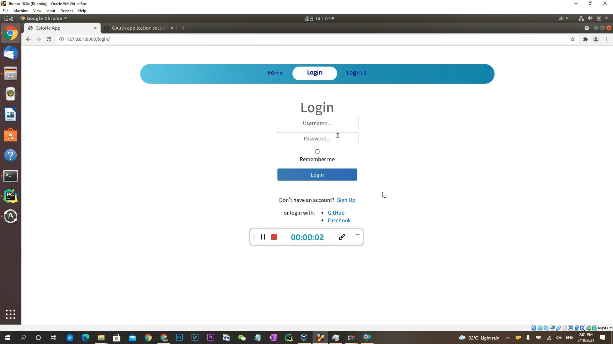
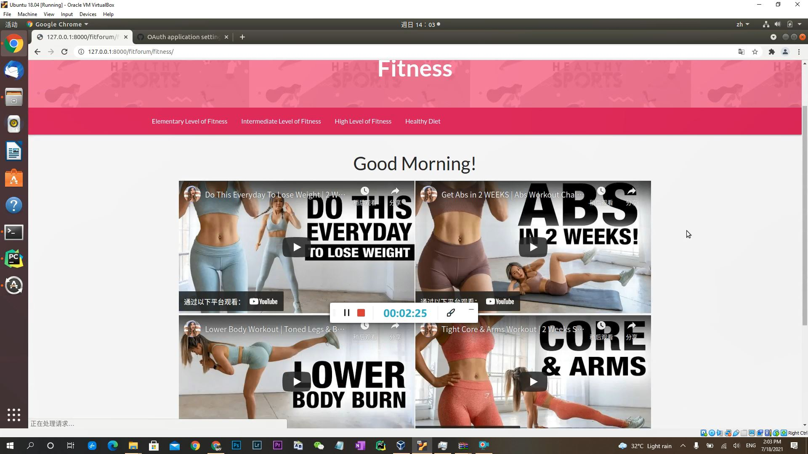
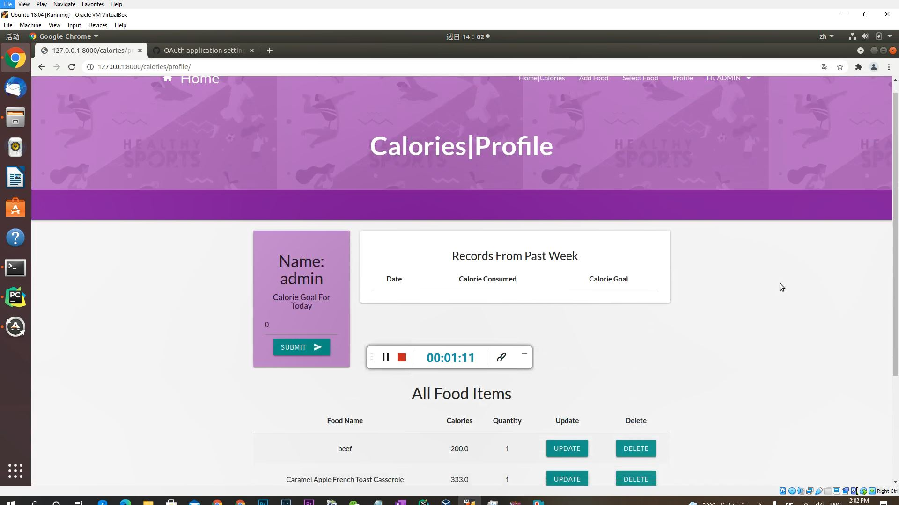
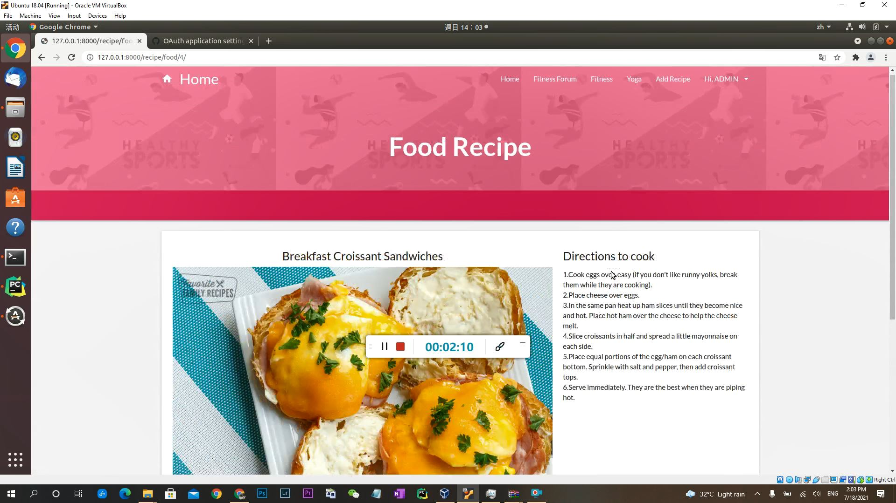
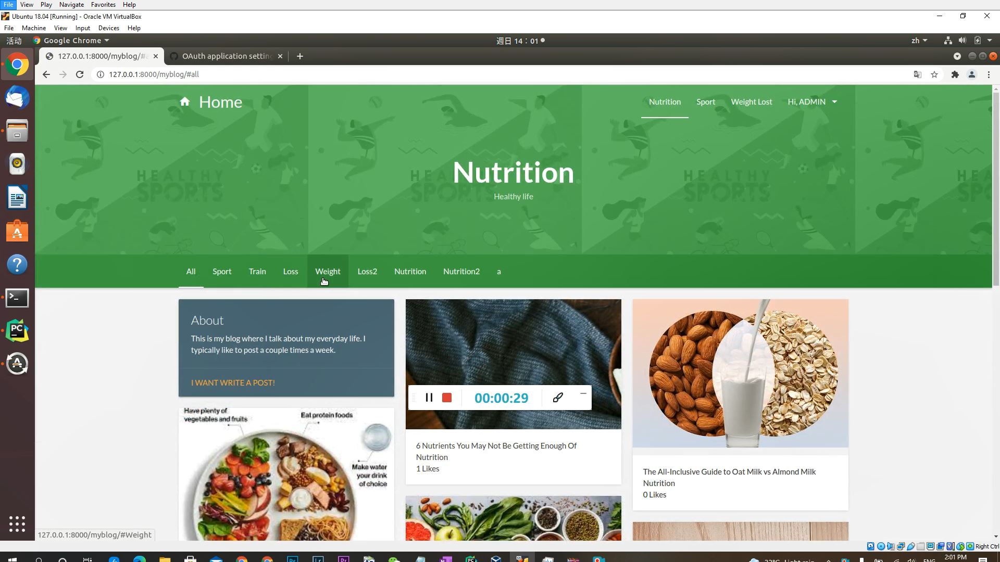
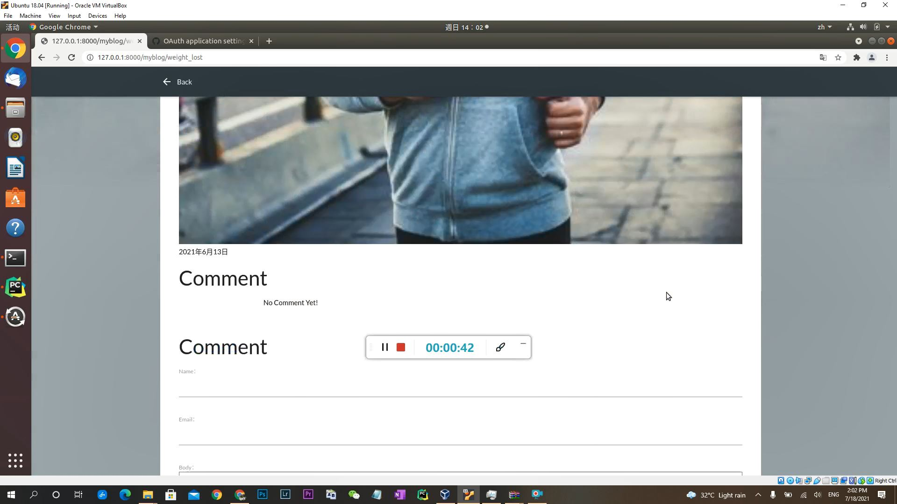
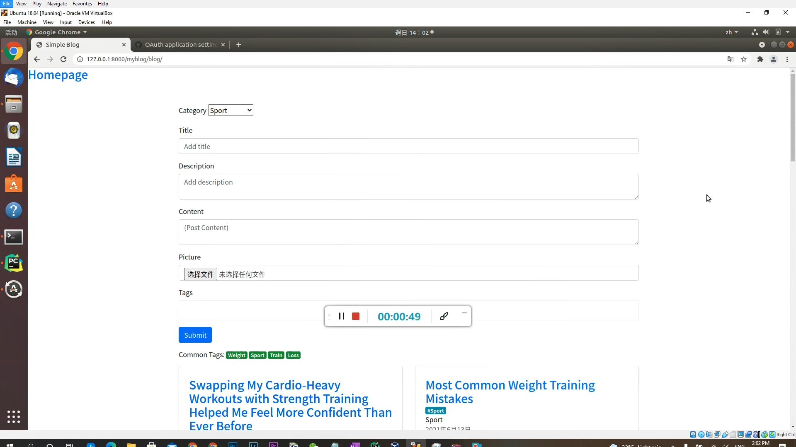
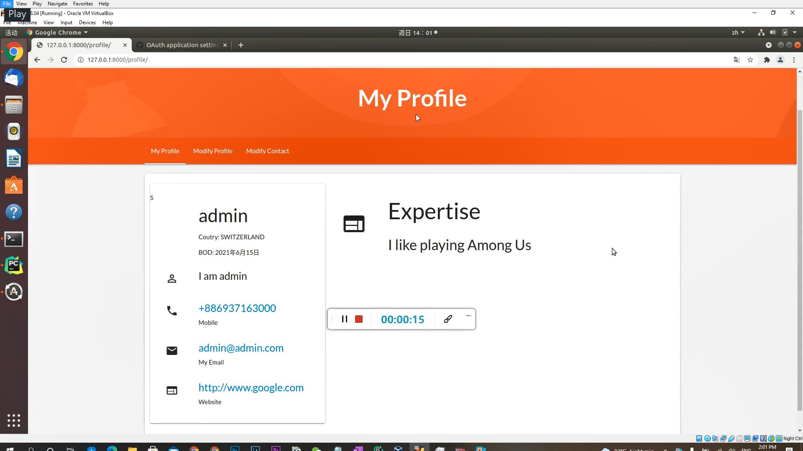

# HealthBridge - Django Healthcare Website
An online health community built with Django where users can share posts, connect through likes and comments, explore wellness videos, discover healthy recipes, and track their BMI and calories with ease.

**Repository:** https://github.com/michestt/HealthBridge-Django.git  
**Developer:** michestt  
**Contact:** michaelsco481@gmail.com

## Installation

Python and Django need to be installed

```bash
pip install django
```

## Usage

Go to the HealthCare folder and run

```bash
python manage.py runserver
```

Then go to the browser and enter the url **http://127.0.0.1:8000/**


## Login

This website allows users to log in using their self-created accounts or through their Facebook or GitHub accounts.

You can access the django admin page at **http://127.0.0.1:8000/admin** and login with username 'admin' and the above password.

Also a new admin user can be created using

```bash
python manage.py createsuperuser
```

## Screenshots

**Login page**



**Video recommendation page**



**Self health management page**



**Food recipe community page**



**Blog page**



**Comment and like function**



**Write and edit post page**



**Profile page**

